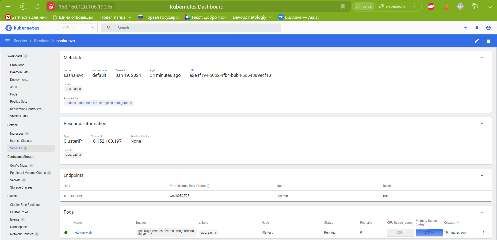

# Домашнее задание к занятию «Базовые объекты K8S»

### Цель задания

В тестовой среде для работы с Kubernetes, установленной в предыдущем ДЗ, необходимо развернуть Pod с приложением и подключиться к нему со своего локального компьютера. 

------

### Чеклист готовности к домашнему заданию

1. Установленное k8s-решение (например, MicroK8S).
2. Установленный локальный kubectl.
3. Редактор YAML-файлов с подключенным Git-репозиторием.

------

### Инструменты и дополнительные материалы, которые пригодятся для выполнения задания

1. Описание [Pod](https://kubernetes.io/docs/concepts/workloads/pods/) и примеры манифестов.
2. Описание [Service](https://kubernetes.io/docs/concepts/services-networking/service/).

------

### Задание 1. Создать Pod с именем hello-world

1. Создать манифест (yaml-конфигурацию) Pod.

[hello-world](main/hello-world.yaml)

2. Использовать image - gcr.io/kubernetes-e2e-test-images/echoserver:2.2.
3. Подключиться локально к Pod с помощью `kubectl port-forward` и вывести значение (curl или в браузере).


<details>
<summary> curl -v localhost:9090 </summary>

```shell
zag1988@k8s-test:~/main$ curl -vvv localhost:9090
*   Trying 127.0.0.1:9090...
* Connected to localhost (127.0.0.1) port 9090 (#0)
> GET / HTTP/1.1
> Host: localhost:9090
> User-Agent: curl/7.81.0
> Accept: */*
> 
* Mark bundle as not supporting multiuse
< HTTP/1.1 200 OK
< Date: Fri, 19 Jan 2024 12:17:23 GMT
< Content-Type: text/plain
< Transfer-Encoding: chunked
< Connection: keep-alive
< Server: echoserver
< 


Hostname: hello-world

Pod Information:
        -no pod information available-

Server values:
        server_version=nginx: 1.12.2 - lua: 10010

Request Information:
        client_address=127.0.0.1
        method=GET
        real path=/
        query=
        request_version=1.1
        request_scheme=http
        request_uri=http://localhost:8080/

Request Headers:
        accept=*/*  
        host=localhost:9090  
        user-agent=curl/7.81.0  

Request Body:
        -no body in request-

* Connection #0 to host localhost left intact

```
</details>

------

### Задание 2. Создать Service и подключить его к Pod

1. Создать Pod с именем netology-web.

[netology-web](main/netology-web.yml)

2. Использовать image — gcr.io/kubernetes-e2e-test-images/echoserver:2.2.
3. Создать Service с именем netology-svc и подключить к netology-web.

[netology-svc](main/netology-svc.yaml)

<details>
<summary> Service </summary>



</details>


4. Подключиться локально к Service с помощью `kubectl port-forward` и вывести значение (curl или в браузере).

<details>
<summary> curl -v localhost:8081 </summary>

```shell
zag1988@k8s-test:~/main$ kubectl port-forward services/sasha-svc 8081:80
Forwarding from 127.0.0.1:8081 -> 8080
Forwarding from [::1]:8081 -> 8080
Handling connection for 8081

zag1988@k8s-test:~/main$ curl -v localhost:8081
*   Trying 127.0.0.1:8081...
* Connected to localhost (127.0.0.1) port 8081 (#0)
> GET / HTTP/1.1
> Host: localhost:8081
> User-Agent: curl/7.81.0
> Accept: */*
> 
* Mark bundle as not supporting multiuse
< HTTP/1.1 200 OK
< Date: Fri, 19 Jan 2024 13:10:15 GMT
< Content-Type: text/plain
< Transfer-Encoding: chunked
< Connection: keep-alive
< Server: echoserver
< 

Hostname: netology-web

Pod Information:
        -no pod information available-

Server values:
        server_version=nginx: 1.12.2 - lua: 10010

Request Information:
        client_address=127.0.0.1
        method=GET
        real path=/
        query=
        request_version=1.1
        request_scheme=http
        request_uri=http://localhost:8080/

Request Headers:
        accept=*/*  
        host=localhost:8081  
        user-agent=curl/7.81.0  

Request Body:
        -no body in request-

* Connection #0 to host localhost left intact
```
</details>

<details>
<summary>kubectl get pods</summary>

```shell
zag1988@k8s-test:~/main$ kubectl get pods -o wide
NAME           READY   STATUS    RESTARTS   AGE   IP             NODE       NOMINATED NODE   READINESS GATES
hello-world    1/1     Running   0          71m   10.1.137.136   k8s-test   <none>           <none>
netology-web   1/1     Running   0          25m   10.1.137.139   k8s-test   <none>           <none>
```
</details>
------

### Правила приёма работы

1. Домашняя работа оформляется в своем Git-репозитории в файле README.md. Выполненное домашнее задание пришлите ссылкой на .md-файл в вашем репозитории.
2. Файл README.md должен содержать скриншоты вывода команд `kubectl get pods`, а также скриншот результата подключения.
3. Репозиторий должен содержать файлы манифестов и ссылки на них в файле README.md.

------

### Критерии оценки
Зачёт — выполнены все задания, ответы даны в развернутой форме, приложены соответствующие скриншоты и файлы проекта, в выполненных заданиях нет противоречий и нарушения логики.

На доработку — задание выполнено частично или не выполнено, в логике выполнения заданий есть противоречия, существенные недостатки.
