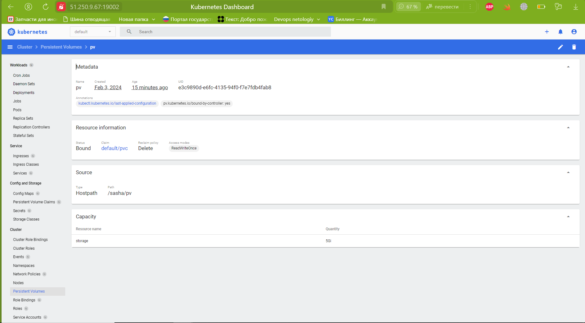
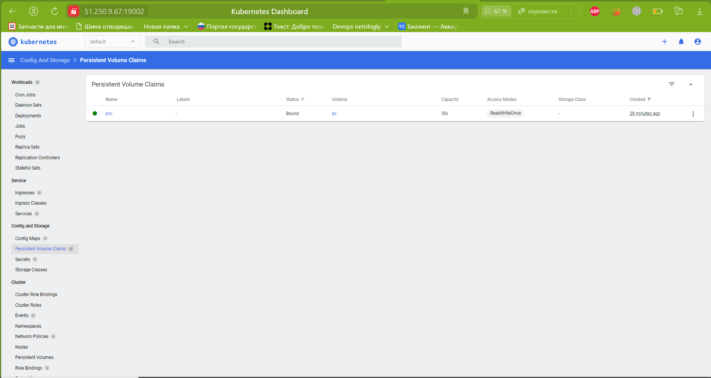
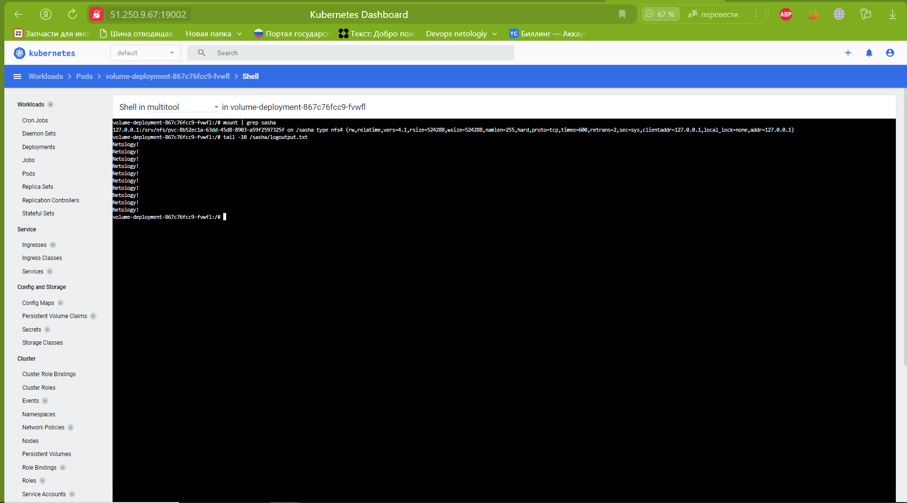

# Домашнее задание к занятию «Хранение в K8s. Часть 2»

### Цель задания

В тестовой среде Kubernetes нужно создать PV и продемострировать запись и хранение файлов.

------

### Чеклист готовности к домашнему заданию

1. Установленное K8s-решение (например, MicroK8S).
2. Установленный локальный kubectl.
3. Редактор YAML-файлов с подключенным GitHub-репозиторием.

------

### Дополнительные материалы для выполнения задания

1. [Инструкция по установке NFS в MicroK8S](https://microk8s.io/docs/nfs). 
2. [Описание Persistent Volumes](https://kubernetes.io/docs/concepts/storage/persistent-volumes/). 
3. [Описание динамического провижининга](https://kubernetes.io/docs/concepts/storage/dynamic-provisioning/). 
4. [Описание Multitool](https://github.com/wbitt/Network-MultiTool).

------

### Задание 1

**Что нужно сделать**

Создать Deployment приложения, использующего локальный PV, созданный вручную.

1. Создать Deployment приложения, состоящего из контейнеров busybox и multitool.

[Deployment](main/volume-deployment.yaml)

2. Создать PV и PVC для подключения папки на локальной ноде, которая будет использована в поде.

[PV.yaml](main/pv.yaml)  



[PVC.yaml](main/pvc.yaml)



3. Продемонстрировать, что multitool может читать файл, в который busybox пишет каждые пять секунд в общей директории. 

```shell
zag1988@k8s-test:~/main/2.2$ kubectl exec volume-deployment-646f458c87-spgvr -c multitool  -- tail -n 10 /sasha/logoutput.txt
Netology!
Netology!
Netology!
Netology!
Netology!
Netology!
Netology!
Netology!
Netology!
Netology!
```

4. Удалить Deployment и PVC. Продемонстрировать, что после этого произошло с PV. Пояснить, почему.

```shell
zag1988@k8s-test:~/main/2.2$ kubectl get deployments
NAME                READY   UP-TO-DATE   AVAILABLE   AGE
volume-deployment   2/2     2            2           55m
zag1988@k8s-test:~/main/2.2$ kubectl delete deployments volume-deployment 
deployment.apps "volume-deployment" deleted
zag1988@k8s-test:~/main/2.2$ kubectl get pvc
NAME   STATUS   VOLUME   CAPACITY   ACCESS MODES   STORAGECLASS   AGE
pvc    Bound    pv       5Gi        RWO                           59m
zag1988@k8s-test:~/main/2.2$ kubectl delete pvc pvc 
persistentvolumeclaim "pvc" deleted
zag1988@k8s-test:~/main/2.2$ kubectl delete pv
error: resource(s) were provided, but no name was specified
zag1988@k8s-test:~/main/2.2$ kubectl get pv
NAME   CAPACITY   ACCESS MODES   RECLAIM POLICY   STATUS   CLAIM         STORAGECLASS   REASON   AGE
pv     5Gi        RWO            Delete           Failed   default/pvc                           47m
zag1988@k8s-test:~/main/2.2$ cd /sasha/
zag1988@k8s-test:/sasha$ ls -l
total 4
drwxr-xr-x 2 root root 4096 Feb  3 08:55 pv
zag1988@k8s-test:/sasha$ cd pv/
zag1988@k8s-test:/sasha/pv$ ls -l
total 12
-rw-r--r-- 1 root root 11000 Feb  3 09:41 logoutput.txt
zag1988@k8s-test:/sasha/pv$ tail -10 logoutput.txt 
Netology!
Netology!
Netology!
Netology!
Netology!
Netology!
Netology!
Netology!
Netology!
Netology!
```
Файл logoutput.txt сохранен, потомучто он располагается локально на ноде кластера k8s. 


5. Продемонстрировать, что файл сохранился на локальном диске ноды. Удалить PV.  Продемонстрировать что произошло с файлом после удаления PV. Пояснить, почему.

```shell
zag1988@k8s-test:/sasha/pv$ ls -l
total 12
-rw-r--r-- 1 root root 11000 Feb  3 09:41 logoutput.txt

zag1988@k8s-test:/sasha/pv$ kubectl get pv
No resources found
zag1988@k8s-test:/sasha/pv$ ls -l
total 12
-rw-r--r-- 1 root root 11000 Feb  3 09:41 logoutput.txt
```
При монтировании Persistent Volume в директорию Kubernetes, содержимое директории не перезаписывается данными с Persistent Volume, а вместо этого создается ссылка на эти данные. Таким образом, при удалении Persistent Volume директория продолжает ссылаться на существующие данные на удаленном хранилище.

5. Предоставить манифесты, а также скриншоты или вывод необходимых команд.

------

### Задание 2

**Что нужно сделать**

Создать Deployment приложения, которое может хранить файлы на NFS с динамическим созданием PV.

1. Включить и настроить NFS-сервер на MicroK8S.

**[Настройка NFS](<main/Настройка NFS.txt>)**

2. Создать Deployment приложения состоящего из multitool, и подключить к нему PV, созданный автоматически на сервере NFS.

**[NFS Deployment](main/volume-deployment.yaml)**

**[Storage Classes](main/storage.yaml)**

<details>
<summary>mounts</summary>

```shell
zag1988@k8s-test:~/main/2.2$ kubectl describe pods volume-deployment-867c76fcc9-fvwfl
Name:             volume-deployment-867c76fcc9-fvwfl
Namespace:        default
Priority:         0
Service Account:  default
Node:             k8s-test/10.128.0.5
Start Time:       Sat, 03 Feb 2024 11:52:12 +0000
Labels:           app=main
                  pod-template-hash=867c76fcc9
Annotations:      cni.projectcalico.org/containerID: 38a20f8bc0fcbd1989fe33e2f97b4f0a607a0ab3466d98d12bf02597c2ec3ee8
                  cni.projectcalico.org/podIP: 10.1.137.146/32
                  cni.projectcalico.org/podIPs: 10.1.137.146/32
Status:           Running
IP:               10.1.137.146
IPs:
  IP:           10.1.137.146
Controlled By:  ReplicaSet/volume-deployment-867c76fcc9
Containers:
  busybox:
    Container ID:  containerd://a138803ae7ded93f3fce5089a84b83da49981efd8c6f27bb782ac10dee2fcccd
    Image:         busybox:latest
    Image ID:      docker.io/library/busybox@sha256:6d9ac9237a84afe1516540f40a0fafdc86859b2141954b4d643af7066d598b74
    Port:          <none>
    Host Port:     <none>
    Command:
      sh
      -c
      while true; do echo Netology! >> /sasha/logoutput.txt; sleep 5; done
    State:          Running
      Started:      Sat, 03 Feb 2024 11:52:15 +0000
    Ready:          True
    Restart Count:  0
    Environment:    <none>
    Mounts:
      /sasha from varlog (rw)
      /var/run/secrets/kubernetes.io/serviceaccount from kube-api-access-df44j (ro)
  multitool:
    Container ID:   containerd://4bda065e10efee046af3be6260a53b13922739ab0c5e39c8499fb37bb23d7a2d
    Image:          wbitt/network-multitool
    Image ID:       docker.io/wbitt/network-multitool@sha256:d1137e87af76ee15cd0b3d4c7e2fcd111ffbd510ccd0af076fc98dddfc50a735
    Port:           <none>
    Host Port:      <none>
    State:          Running
      Started:      Sat, 03 Feb 2024 11:52:17 +0000
    Ready:          True
    Restart Count:  0
    Environment:    <none>
    Mounts:
      /sasha from varlog (rw)
      /var/run/secrets/kubernetes.io/serviceaccount from kube-api-access-df44j (ro)
Conditions:
  Type              Status
  Initialized       True 
  Ready             True 
  ContainersReady   True 
  PodScheduled      True 
Volumes:
  varlog:
    Type:       PersistentVolumeClaim (a reference to a PersistentVolumeClaim in the same namespace)
    ClaimName:  pvc-nfs
    ReadOnly:   false
  kube-api-access-df44j:
    Type:                    Projected (a volume that contains injected data from multiple sources)
    TokenExpirationSeconds:  3607
    ConfigMapName:           kube-root-ca.crt
    ConfigMapOptional:       <nil>
    DownwardAPI:             true
QoS Class:                   BestEffort
Node-Selectors:              <none>
Tolerations:                 node.kubernetes.io/not-ready:NoExecute op=Exists for 300s
                             node.kubernetes.io/unreachable:NoExecute op=Exists for 300s
Events:                      <none>
```
</details>

3. Продемонстрировать возможность чтения и записи файла изнутри пода. 



4. Предоставить манифесты, а также скриншоты или вывод необходимых команд.

------

### Правила приёма работы

1. Домашняя работа оформляется в своём Git-репозитории в файле README.md. Выполненное задание пришлите ссылкой на .md-файл в вашем репозитории.
2. Файл README.md должен содержать скриншоты вывода необходимых команд `kubectl`, а также скриншоты результатов.
3. Репозиторий должен содержать тексты манифестов или ссылки на них в файле README.md.
