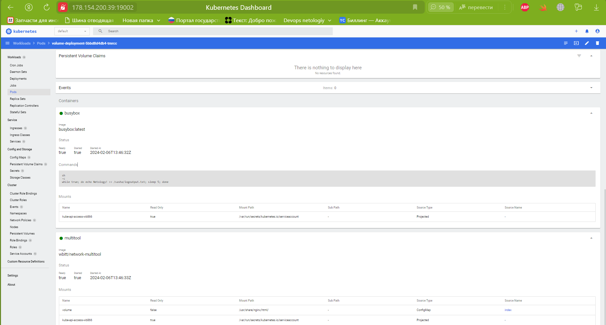
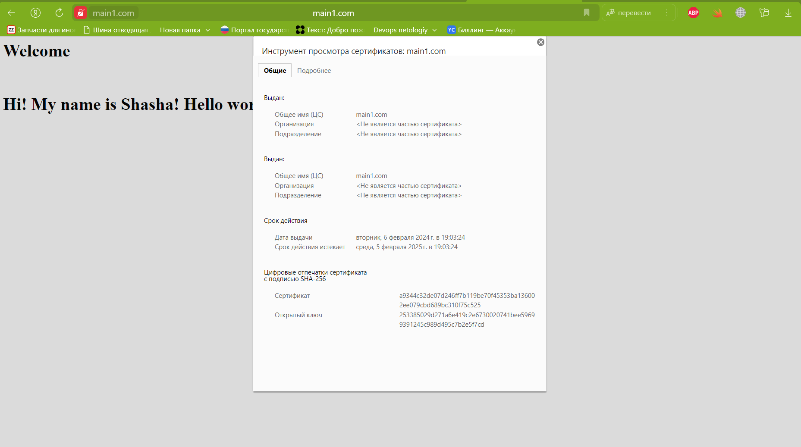

# Домашнее задание к занятию «Конфигурация приложений»

### Цель задания

В тестовой среде Kubernetes необходимо создать конфигурацию и продемонстрировать работу приложения.

------

### Чеклист готовности к домашнему заданию

1. Установленное K8s-решение (например, MicroK8s).
2. Установленный локальный kubectl.
3. Редактор YAML-файлов с подключённым GitHub-репозиторием.

------

### Инструменты и дополнительные материалы, которые пригодятся для выполнения задания

1. [Описание](https://kubernetes.io/docs/concepts/configuration/secret/) Secret.
2. [Описание](https://kubernetes.io/docs/concepts/configuration/configmap/) ConfigMap.
3. [Описание](https://github.com/wbitt/Network-MultiTool) Multitool.

------

### Задание 1. Создать Deployment приложения и решить возникшую проблему с помощью ConfigMap. Добавить веб-страницу

1. Создать Deployment приложения, состоящего из контейнеров nginx и multitool.

При создании подов возникает ошибка, связанная с отсутвующим объектом configmap:

```shell

zag1988@k8s-test:~/main/2.3$ kubectl get pods
NAME                                 READY   STATUS              RESTARTS   AGE
volume-deployment-5bbd8d4db4-tvgnx   0/2     ContainerCreating   0          3m18s
volume-deployment-5bbd8d4db4-tmrcc   0/2     ContainerCreating   0          3m12s

**MountVolume.SetUp failed for volume "volume" : configmap "index" not found**
```

2. Решить возникшую проблему с помощью ConfigMap.

После создания 'configmap', под стартует и оба контейнера поднимаються:

```shell
zag1988@k8s-test:~/main/2.3$ kubectl get pods
NAME                                 READY   STATUS    RESTARTS   AGE
volume-deployment-5bbd8d4db4-tvgnx   2/2     Running   0          7m28s
volume-deployment-5bbd8d4db4-tmrcc   2/2     Running   0          7m22s
zag1988@k8s-test:~/main/2.3$ kubectl describe pods volume-deployment-5bbd8d4db4-tvgnx
Name:             volume-deployment-5bbd8d4db4-tvgnx
Namespace:        default
Priority:         0
Service Account:  default
Node:             k8s-test/10.128.0.5
Start Time:       Tue, 06 Feb 2024 13:42:14 +0000
Labels:           app=main
                  pod-template-hash=5bbd8d4db4
Annotations:      cni.projectcalico.org/containerID: 5a76ab4a7b12d62228a985124791510631dfa24415f6a8d49e17633a70bab624
                  cni.projectcalico.org/podIP: 10.1.137.154/32
                  cni.projectcalico.org/podIPs: 10.1.137.154/32
Status:           Running
IP:               10.1.137.154
IPs:
  IP:           10.1.137.154
Controlled By:  ReplicaSet/volume-deployment-5bbd8d4db4
Containers:
  busybox:
    Container ID:  containerd://239dccc6b0fe893fdd22f9fbf7a06f8015425a8d0f23b078cabd5fd9cd6eae68
    Image:         busybox:latest
    Image ID:      docker.io/library/busybox@sha256:6d9ac9237a84afe1516540f40a0fafdc86859b2141954b4d643af7066d598b74
    Port:          <none>
    Host Port:     <none>
    Command:
      sh
      -c
      while true; do echo Netology! >> /sasha/logoutput.txt; sleep 5; done
    State:          Running
      Started:      Tue, 06 Feb 2024 13:46:26 +0000
    Ready:          True
    Restart Count:  0
    Environment:    <none>
    Mounts:
      /var/run/secrets/kubernetes.io/serviceaccount from kube-api-access-dcwrg (ro)
  multitool:
    Container ID:   containerd://e22dea49e80b3df648bf59d7f46e89ab9cd34ea7b8eac65e2d85c24d22c4cf3c
    Image:          wbitt/network-multitool
    Image ID:       docker.io/wbitt/network-multitool@sha256:d1137e87af76ee15cd0b3d4c7e2fcd111ffbd510ccd0af076fc98dddfc50a735
    Port:           <none>
    Host Port:      <none>
    State:          Running
      Started:      Tue, 06 Feb 2024 13:46:27 +0000
    Ready:          True
    Restart Count:  0
    Environment:    <none>
    Mounts:
      /usr/share/nginx/html/ from volume (rw)
      /var/run/secrets/kubernetes.io/serviceaccount from kube-api-access-dcwrg (ro)
Conditions:
  Type              Status
  Initialized       True 
  Ready             True 
  ContainersReady   True 
  PodScheduled      True 
Volumes:
  volume:
    Type:      ConfigMap (a volume populated by a ConfigMap)
    Name:      index
    Optional:  false
  kube-api-access-dcwrg:
    Type:                    Projected (a volume that contains injected data from multiple sources)
    TokenExpirationSeconds:  3607
    ConfigMapName:           kube-root-ca.crt
    ConfigMapOptional:       <nil>
    DownwardAPI:             true
QoS Class:                   BestEffort
Node-Selectors:              <none>
Tolerations:                 node.kubernetes.io/not-ready:NoExecute op=Exists for 300s
                             node.kubernetes.io/unreachable:NoExecute op=Exists for 300s
Events:
  Type    Reason   Age    From     Message
  ----    ------   ----   ----     -------
  Normal  Pulling  3m21s  kubelet  Pulling image "busybox:latest"
  Normal  Pulled   3m20s  kubelet  Successfully pulled image "busybox:latest" in 994ms (994ms including waiting)
  Normal  Created  3m20s  kubelet  Created container busybox
  Normal  Started  3m20s  kubelet  Started container busybox
  Normal  Pulling  3m20s  kubelet  Pulling image "wbitt/network-multitool"
  Normal  Pulled   3m19s  kubelet  Successfully pulled image "wbitt/network-multitool" in 992ms (992ms including waiting)
  Normal  Created  3m19s  kubelet  Created container multitool
  Normal  Started  3m19s  kubelet  Started container multitool
```

3. Продемонстрировать, что pod стартовал и оба конейнера работают.




4. Сделать простую веб-страницу и подключить её к Nginx с помощью ConfigMap. Подключить Service и показать вывод curl или в браузере.

```shell
zag1988@k8s-test:~/main/2.3$ kubectl get svc
NAME         TYPE        CLUSTER-IP       EXTERNAL-IP   PORT(S)        AGE
kubernetes   ClusterIP   10.152.183.1     <none>        443/TCP        19d
myservice    NodePort    10.152.183.167   <none>        80:31280/TCP   158m
zag1988@k8s-test:~/main/2.3$ curl -v 178.154.200.39:31280
*   Trying 178.154.200.39:31280...
* Connected to 178.154.200.39 (178.154.200.39) port 31280 (#0)
> GET / HTTP/1.1
> Host: 178.154.200.39:31280
> User-Agent: curl/7.81.0
> Accept: */*
> 
* Mark bundle as not supporting multiuse
< HTTP/1.1 200 OK
< Server: nginx/1.24.0
< Date: Tue, 06 Feb 2024 15:38:07 GMT
< Content-Type: text/html
< Content-Length: 82
< Last-Modified: Tue, 06 Feb 2024 13:46:24 GMT
< Connection: keep-alive
< ETag: "65c23830-52"
< Accept-Ranges: bytes
< 
<html>
<h1>Welcome</h1>
</br>
<h1>Hi! My name is Shasha! Hello world </h1>
</html
* Connection #0 to host 178.154.200.39 left intact

```

5. Предоставить манифесты, а также скриншоты или вывод необходимых команд.

**[Deployment](main/configmap-deployment.yaml)**

**[ConfigMap](main/configmap-for-nginx.yaml)**

**[Service](main/service-for-configmap.yaml)**

------

### Задание 2. Создать приложение с вашей веб-страницей, доступной по HTTPS 

1. Создать Deployment приложения, состоящего из Nginx.
2. Создать собственную веб-страницу и подключить её как ConfigMap к приложению.
3. Выпустить самоподписной сертификат SSL. Создать Secret для использования сертификата.

```shell
zag1988@k8s-test:~/main/2.3$ openssl req -x509 -newkey rsa:4096 -sha256 -nodes -keyout tls.key -out tls.crt -subj "/CN=main1.com" -days 365
......+...+.....+...+....+..+.............+..+...............+...+......+....+...+..+.+.....+.+.....+.+..+.......+.....+.+...............+++++++++++++++++++++++


zag1988@k8s-test:~/main/2.3$ microk8s kubectl create secret tls main1-secret-tls --cert=tls.crt --key=tls.key
secret/main1-secret-tls created

```

4. Создать Ingress и необходимый Service, подключить к нему SSL в вид. Продемонстировать доступ к приложению по HTTPS. 

[etc/hosts](main/etc/hosts.txt)


```shell

zag1988@k8s-test:~/main/2.3$ kubectl get ingress
NAME          CLASS    HOSTS       ADDRESS     PORTS     AGE
ingressmain   public   main1.com   127.0.0.1   80, 443   19m

zag1988@k8s-test:~/main/2.3$ kubectl get svc
NAME         TYPE        CLUSTER-IP      EXTERNAL-IP   PORT(S)        AGE
kubernetes   ClusterIP   10.152.183.1    <none>        443/TCP        19d
myservice    NodePort    10.152.183.68   <none>        80:31280/TCP   19m


zag1988@k8s-test:~/main/2.3$ curl -k https://main1.com
<html>
<h1>Welcome</h1>
</br>
<h1>Hi! My name is Shasha! Hello world </h1>
</html

```

<details>
<summary>https://main1.com</summary>



</details>


4. Предоставить манифесты, а также скриншоты или вывод необходимых команд.

**[Service for NGINX](main/service-for-nginx.yaml)**

**[Ingress](main/ingress.yaml)**

**[Deployment for nginx](main/deployment-nginx.yaml)**

------

### Правила приёма работы

1. Домашняя работа оформляется в своём GitHub-репозитории в файле README.md. Выполненное домашнее задание пришлите ссылкой на .md-файл в вашем репозитории.
2. Файл README.md должен содержать скриншоты вывода необходимых команд `kubectl`, а также скриншоты результатов.
3. Репозиторий должен содержать тексты манифестов или ссылки на них в файле README.md.

------
