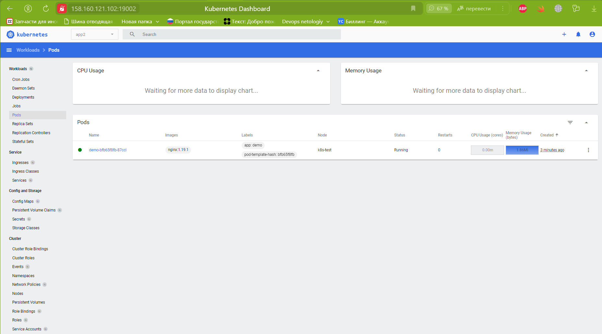
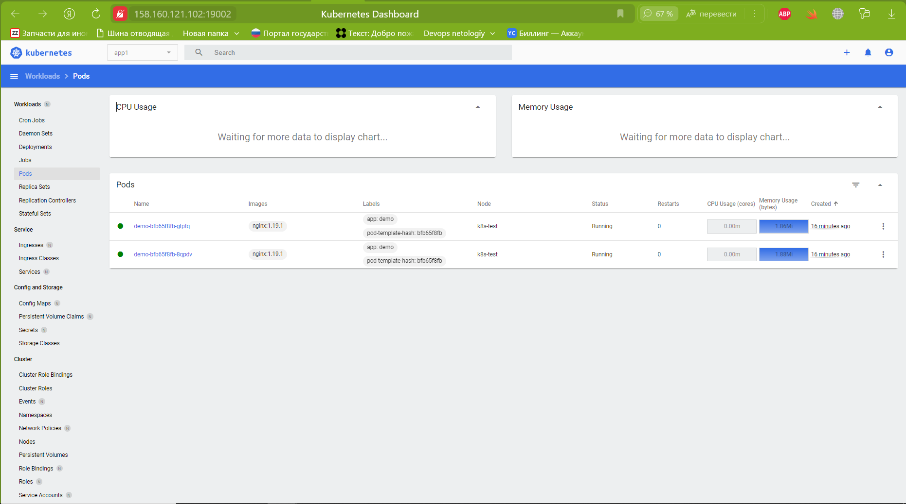

# Домашнее задание к занятию «Helm»

### Цель задания

В тестовой среде Kubernetes необходимо установить и обновить приложения с помощью Helm.

------

### Чеклист готовности к домашнему заданию

1. Установленное k8s-решение, например, MicroK8S.
2. Установленный локальный kubectl.
3. Установленный локальный Helm.
4. Редактор YAML-файлов с подключенным репозиторием GitHub.

------

### Инструменты и дополнительные материалы, которые пригодятся для выполнения задания

1. [Инструкция](https://helm.sh/docs/intro/install/) по установке Helm. [Helm completion](https://helm.sh/docs/helm/helm_completion/).

------

### Задание 1. Подготовить Helm-чарт для приложения

1. Необходимо упаковать приложение в чарт для деплоя в разные окружения. 

    Скачал шаблон для чарта:
```shell
    zag1988@k8s-test:~/main/2.5/charts$ ls -l 01-simple/
    total 28
    -rw-rw-r-- 1 zag1988 zag1988  120 Feb  8 14:29 Chart.yaml
    -rw-rw-r-- 1 zag1988 zag1988   40 Feb  8 14:29 new-values2.yaml
    -rw-rw-r-- 1 zag1988 zag1988  319 Feb  8 14:29 new-values-from-jsonnet.yaml
    -rw-rw-r-- 1 zag1988 zag1988  162 Feb  8 14:29 new-values.json
    -rw-rw-r-- 1 zag1988 zag1988   23 Feb  8 14:29 new-values.yaml
    drwxrwxr-x 2 zag1988 zag1988 4096 Feb  8 14:29 templates
    -rw-rw-r-- 1 zag1988 zag1988  255 Feb  8 14:29 values.yaml
```
На базе данного шаблона создадим свой:
```shell

zag1988@k8s-test:~/main/2.5/charts$ helm template 01-simple/
---
# Source: hard/templates/service.yaml
apiVersion: v1
kind: Service
metadata:
  name: demo
  labels:
    app: demo
spec:
  ports:
    - port: 80
      name: http
  selector:
    app: demo
---
# Source: hard/templates/deployment.yaml
apiVersion: apps/v1
kind: Deployment
metadata:
  name: demo
  labels:
    app: demo
spec:
  replicas: 1
  selector:
    matchLabels:
      app: demo
  template:
    metadata:
      labels:
        app: demo
    spec:
      containers:
        - name: hard
          image: "nginx:"
          imagePullPolicy: IfNotPresent
          ports:
            - name: http
              containerPort: 80
              protocol: TCP
          resources:
            limits:
              cpu: 200m
              memory: 256Mi
            requests:
              cpu: 100m
              memory: 128Mi
```

Версия приложения не установлена. Передадим версию приложения через переменную **[Value](chart/01-simple/new-values.yaml)** 

```shell
zag1988@k8s-test:~/main/2.5/charts$  helm template -f 01-simple/new-values.yaml 01-simple
---
# Source: hard/templates/service.yaml
apiVersion: v1
kind: Service
metadata:
  name: demo
  labels:
    app: demo
spec:
  ports:
    - port: 80
      name: http
  selector:
    app: demo
---
# Source: hard/templates/deployment.yaml
apiVersion: apps/v1
kind: Deployment
metadata:
  name: demo
  labels:
    app: demo
spec:
  replicas: 1
  selector:
    matchLabels:
      app: demo
  template:
    metadata:
      labels:
        app: demo
    spec:
      containers:
        - name: hard
          image: "nginx:1.19.1"
          imagePullPolicy: IfNotPresent
          ports:
            - name: http
              containerPort: 80
              protocol: TCP
          resources:
            limits:
              cpu: 200m
              memory: 256Mi
            requests:
              cpu: 100m
              memory: 128Mi
```

В итоге, c помощью шаблона, задеплоили объекты 'pod' и 'service', с версией nginx 1.19.1:

```shell
zag1988@k8s-test:~/main/2.5/charts$ helm install demo1 --set replicaCount=3 01-simple/ --values 01-simple/new-values.yaml 
NAME: demo1
LAST DEPLOYED: Fri Feb  9 11:41:13 2024
NAMESPACE: default
STATUS: deployed
REVISION: 1
TEST SUITE: None
NOTES:
---------------------------------------------------------

Content of NOTES.txt appears after deploy.
Deployed version 1.19.1.
```


<details>
<summary>Pod demo</summary>

```shell
apiVersion: apps/v1
kind: Deployment
metadata:
  annotations:
    deployment.kubernetes.io/revision: "1"
    meta.helm.sh/release-name: demo1
    meta.helm.sh/release-namespace: default
  creationTimestamp: "2024-02-09T11:41:13Z"
  generation: 1
  labels:
    app: demo
    app.kubernetes.io/managed-by: Helm
  name: demo
  namespace: default
  resourceVersion: "889467"
  uid: 092b0ff1-ffaa-41e2-99c3-0833a441fe4e
spec:
  progressDeadlineSeconds: 600
  replicas: 3
  revisionHistoryLimit: 10
  selector:
    matchLabels:
      app: demo
  strategy:
    rollingUpdate:
      maxSurge: 25%
      maxUnavailable: 25%
    type: RollingUpdate
  template:
    metadata:
      creationTimestamp: null
      labels:
        app: demo
    spec:
      containers:
      - image: nginx:1.19.1
        imagePullPolicy: IfNotPresent
        name: hard
        ports:
        - containerPort: 80
          name: http
          protocol: TCP
        resources:
          limits:
            cpu: 200m
            memory: 256Mi
          requests:
            cpu: 100m
            memory: 128Mi
        terminationMessagePath: /dev/termination-log
        terminationMessagePolicy: File
      dnsPolicy: ClusterFirst
      restartPolicy: Always
      schedulerName: default-scheduler
      securityContext: {}
      terminationGracePeriodSeconds: 30
status:
  availableReplicas: 3
  conditions:
  - lastTransitionTime: "2024-02-09T11:41:15Z"
    lastUpdateTime: "2024-02-09T11:41:15Z"
    message: Deployment has minimum availability.
    reason: MinimumReplicasAvailable
    status: "True"
    type: Available
  - lastTransitionTime: "2024-02-09T11:41:13Z"
    lastUpdateTime: "2024-02-09T11:41:15Z"
    message: ReplicaSet "demo-bfb65f8fb" has successfully progressed.
    reason: NewReplicaSetAvailable
    status: "True"
    type: Progressing
  observedGeneration: 1
  readyReplicas: 3
  replicas: 3
  updatedReplicas: 3

```

</details>

<details>
<summary>Service demo</summary>

```shell
apiVersion: v1
kind: Service
metadata:
  annotations:
    meta.helm.sh/release-name: demo1
    meta.helm.sh/release-namespace: default
  creationTimestamp: "2024-02-09T11:41:13Z"
  labels:
    app: demo
    app.kubernetes.io/managed-by: Helm
  name: demo
  namespace: default
  resourceVersion: "889406"
  uid: 3a503757-16e4-469f-827b-60d83c76b440
spec:
  clusterIP: 10.152.183.184
  clusterIPs:
  - 10.152.183.184
  internalTrafficPolicy: Cluster
  ipFamilies:
  - IPv4
  ipFamilyPolicy: SingleStack
  ports:
  - name: http
    port: 80
    protocol: TCP
    targetPort: 80
  selector:
    app: demo
  sessionAffinity: None
  type: ClusterIP
status:
  loadBalancer: {}

```

</details>

 
2. Каждый компонент приложения деплоится отдельным deployment’ом или statefulset’ом.
3. В переменных чарта измените образ приложения для изменения версии.

------
### Задание 2. Запустить две версии в разных неймспейсах

1. Подготовив чарт, необходимо его проверить. Запуститe несколько копий приложения.
Запускаем приложение 'demo' из созданного ранее шаблона:

```shell
ag1988@k8s-test:~/main/2.5/charts$ helm install demo1 01-simple
NAME: demo1
LAST DEPLOYED: Thu Feb  8 14:52:34 2024
NAMESPACE: default
STATUS: deployed
REVISION: 1
TEST SUITE: None
NOTES:
---------------------------------------------------------

Content of NOTES.txt appears after deploy.
Deployed version 1.19.1.

zag1988@k8s-test:~/main/2.5/charts$ kubectl get svc
NAME         TYPE        CLUSTER-IP      EXTERNAL-IP   PORT(S)   AGE
kubernetes   ClusterIP   10.152.183.1    <none>        443/TCP   21d
demo         ClusterIP   10.152.183.76   <none>        80/TCP    20h

zag1988@k8s-test:~/main/2.5/charts$ kubectl get pods
NAME                   READY   STATUS    RESTARTS   AGE
demo-bfb65f8fb-mlpcd   1/1     Running   0          2m9s

zag1988@k8s-test:~/main/2.5/charts$ helm list
NAME    NAMESPACE       REVISION        UPDATED                                 STATUS          CHART           APP VERSION
demo1   default         1               2024-02-08 14:52:34.603658242 +0000 UTC deployed        hard-0.1.2      1.19.1     

```
Создадим несколько версий приложения:

```shell
zag1988@k8s-test:~/main/2.5/charts$ helm upgrade demo1 --set replicaCount=2 01-simple/
Release "demo1" has been upgraded. Happy Helming!
NAME: demo1
LAST DEPLOYED: Thu Feb  8 15:05:29 2024
NAMESPACE: default
STATUS: deployed
REVISION: 3
TEST SUITE: None
NOTES:
---------------------------------------------------------

Content of NOTES.txt appears after deploy.
Deployed version 1.19.1.

---------------------------------------------------------

zag1988@k8s-test:~/main/2.5/charts$ kubectl get pods
NAME                   READY   STATUS    RESTARTS   AGE
demo-bfb65f8fb-mlpcd   1/1     Running   0          15m
demo-bfb65f8fb-2qpnv   1/1     Running   0          3m34s
```

2. Одну версию в namespace=app1, вторую версию в том же неймспейсе, третью версию в namespace=app2.

Создадим в namespace app1 две версии приложения demo2:

```shell
zag1988@k8s-test:~/main/2.5/charts$ helm install demo2 --namespace app1 --create-namespace --wait --set replicaCount=2 01-simple
NAME: demo2
LAST DEPLOYED: Thu Feb  8 15:12:31 2024
NAMESPACE: app1
STATUS: deployed
REVISION: 1
TEST SUITE: None
NOTES:
---------------------------------------------------------

Content of NOTES.txt appears after deploy.
Deployed version 1.19.1.

zag1988@k8s-test:~/main/2.5/charts$ kubectl get pods -n app1 
NAME                   READY   STATUS    RESTARTS   AGE
demo-bfb65f8fb-gtptq   1/1     Running   0          3m3s
demo-bfb65f8fb-8qpdv   1/1     Running   0          3m3s

```
В namespace app2 одну версию приложения demo3:

```shell

zag1988@k8s-test:~/main/2.5/charts$ helm install demo3 --namespace app2 --create-namespace --wait --set replicaCount=1 01-simple
NAME: demo3
LAST DEPLOYED: Thu Feb  8 15:26:13 2024
NAMESPACE: app2
STATUS: deployed
REVISION: 1
TEST SUITE: None
NOTES:
---------------------------------------------------------

Content of NOTES.txt appears after deploy.
Deployed version 1.19.1.

---------------------------------------------------------
zag1988@k8s-test:~/main/2.5/charts$ kubectl get pods -n app2
NAME                   READY   STATUS    RESTARTS   AGE
demo-bfb65f8fb-87ccl   1/1     Running   0          20s

```

3. Продемонстрируйте результат.

<details>
<summary>Namespace app1 app2</summary>





</details>


### Правила приёма работы

1. Домашняя работа оформляется в своём Git репозитории в файле README.md. Выполненное домашнее задание пришлите ссылкой на .md-файл в вашем репозитории.
2. Файл README.md должен содержать скриншоты вывода необходимых команд `kubectl`, `helm`, а также скриншоты результатов.
3. Репозиторий должен содержать тексты манифестов или ссылки на них в файле README.md.

